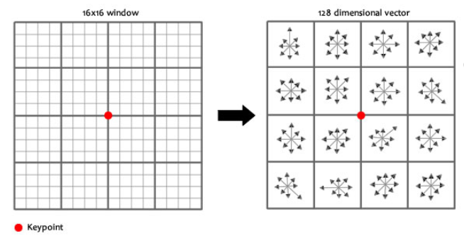
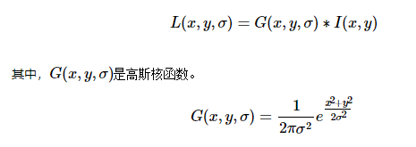
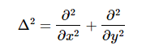
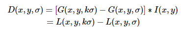
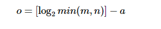
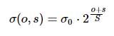
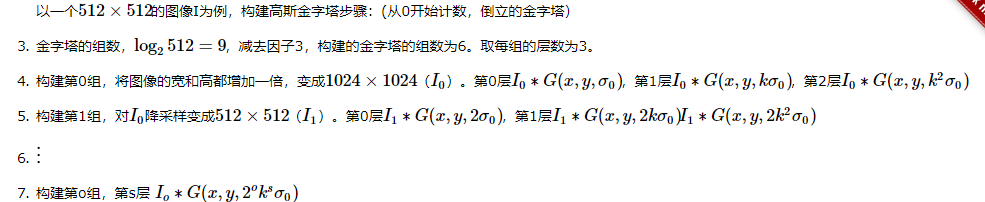
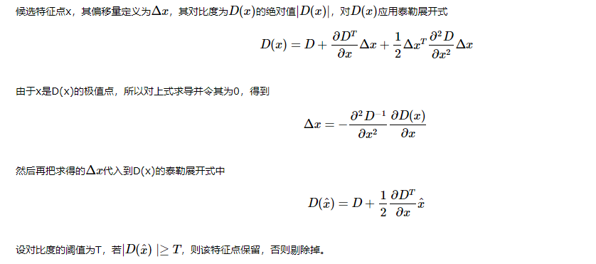
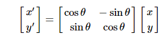
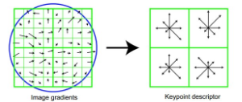

# SIFT
[参考](https://www.cnblogs.com/wangguchangqing/p/4853263.html#autoid-3-0-0)  
# 特点：   
1.对旋转，多尺度，光照变化保持不变，对视角变化，噪声也保持一定程度稳定性  
2.对很少的样本也能产生大量的特征  
3.速度快
4.独特性好，在大量数据中也能进行匹配搜索  
5.很容易和其他特征联合  
# SIFT构建的主要步骤  
1.构建多尺度金字塔（尺度不变）：通过高斯微分函数来实现多尺度  
2.选择关键点：根据相邻像素的差值（梯度）选择在多个尺度上都存在的特征点  
3.删除不合适的点：主要删除低对比度点和不稳定的边缘相应点
4.确定主方向：以关键点为中心，一定值的半径计算各个点的梯度的幅角和幅值，然后建立直方图，横坐标为梯度的方向，纵坐标为赋值的累加，最终最大的为特征值的方向  
5.以关键点为中心，将周围16x16的邻域的坐标轴方向转换为关键点的方向，将关键点由16个子点描述，每个子点由4x4的像素构  成，并将4x4内的幅度与幅值转换为有8个方向的子点，所以一个关键点由 4*4*8=128维的特获表示

# 详细步骤：  
## 多分辨率金字塔：
  方式1：下采样，长宽同时下采样为原来的1/2，先对图像进行平滑  
  方式2：使用高斯函数作为核，通过改变高斯函数的参数来达到模糊图像的目的，模拟人眼在远观物体时所显示的图像会变模糊     
  
 ## 检测特征点  
 较好的检测特征点的方法时 高斯拉普拉斯(LoG): 
 但是这种方法计算量较大，所以采用差分高斯(DoG)近似的计算LoG  
   
 建立金字塔时，分为多个组，每个组由多个高斯核进行模糊图像，组成多层，所以一个金字塔有多个组，每个组有多个层  
 
 金子塔的组数一般是：  
 m,n分别时图像的行和列，a取0~等式前面值的任意值，高斯模型参数由下士得到：  
   
 o为所在的组，s为所在的层，S为每组的层数。  
 ### 高斯金字塔构建实例： 
   
 ### 极值检测：  
 为了寻找尺度空间的极值点，每个像素点要和其图像域（同一尺度空间）和尺度域（相邻的尺度空间）的所有相邻点进行比较，当其大于（或者小于）所有相邻点时，改点就是极值点。  
 #### 尺度变换的连续性：  
 这样每组的第一层与最后一层无法比较，所以每组多建几个层，取中间的值
 ## 删除不好的特征点：  
 上述取得的极值点是在离散的情况下取得的，不是真正意义上的极值点，所以将不满足的点去掉，主要去掉低对比度的点和不稳定的边缘相应点  
 #### 低对比度点  
   
 #### 删除不稳定的边缘点  
 在边缘的主方向上的曲率值较大，而沿着边缘方向主曲率较小。  
 间参考链接  
 ## 求特征点的主方向  
 为了实现旋转不变性，需要给特征点的方向进行赋值，利用特征点领域像素的梯度分布特性来确定方向参数，在利用图像的梯度直方图确定特征点的主方向。 
 !(主方向)[./9.PNG]  
 
 计算得到梯度方向后，就要使用直方图统计特征点邻域内像素对应的梯度方向和幅值。梯度方向的直方图的横轴是梯度方向的角度（梯度方向的范围是0到360度，直方图每36度一个柱共10个柱，或者没45度一个柱共8个柱），纵轴是梯度方向对应梯度幅值的累加，在直方图的峰值就是特征点的主方向。在Lowe的论文还提到了使用高斯函数对直方图进行平滑以增强特征点近的邻域点对关键点方向的作用，并减少突变的影响。为了得到更精确的方向，通常还可以对离散的梯度直方图进行插值拟合。具体而言，关键点的方向可以由和主峰值最近的三个柱值通过抛物线插值得到。在梯度直方图中，当存在一个相当于主峰值80%能量的柱值时，则可以将这个方向认为是该特征点辅助方向。所以，一个特征点可能检测到多个方向（也可以理解为，一个特征点可能产生多个坐标、尺度相同，但是方向不同的特征点）.  
## 生成特征描述  
将上述的信息用一组向量来表示，也就是描述子，描述子不只包含特征点，也含有周围对特征点有贡献的像素点。  
描述子应具有较高的独立性，保证匹配率  

 特征描述符的生成大致有三个步骤： 
  校正旋转主方向，确保旋转不变性。 
  生成描述子，最终形成一个128维的特征向量  
  归一化处理，将特征向量长度进行归一化处理，进一步去除光照的影响。  
 为了保证旋转不变性，要以特征点为中心，将附近的邻域内将坐标轴悬着到特征点的主方向，旋转后的坐标为：
   

 旋转后以主方向为中心取 8×8的窗口。下图所示，左图的中央为当前关键点的位置，每个小格代表为关键点邻域所在尺度空间的一个像素，求取每个像素的梯度幅值与梯度方向，箭头方向代表该像素的梯度方向，长度代表梯度幅值，然后利用高斯窗口对其进行加权运算。最后在每个4×4的小块上绘制8个方向的梯度直方图，计算每个梯度方向的累加值，即可形成一个种子点，如右图所示。每个特征点由4个种子点组成，每个种子点有8个方向的向量信息。这种邻域方向性信息联合增强了算法的抗噪声能力，同时对于含有定位误差的特征匹配也提供了比较理性的容错性。
 
 与求主方向不同，此时每个种子区域的梯度直方图在0-360之间划分为8个方向区间，每个区间为45度，即每个种子点有8个方向的梯度强度信息。
在实际的计算过程中，为了增强匹配的稳健性使用16*16的窗口，最终产生4*4个种子点来描述
